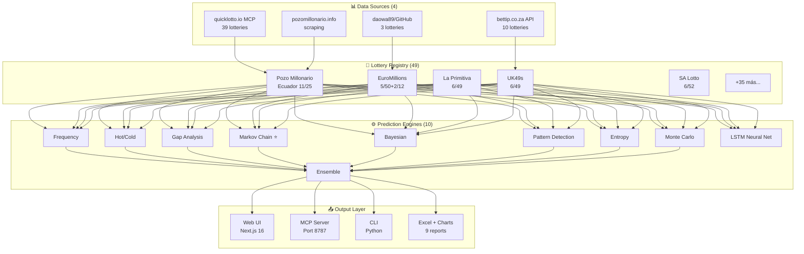
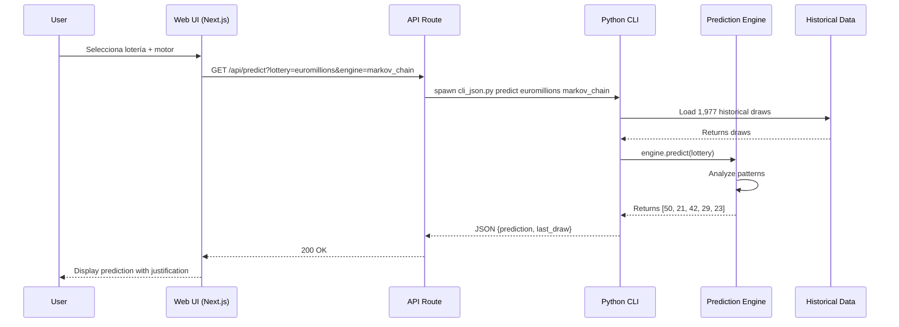
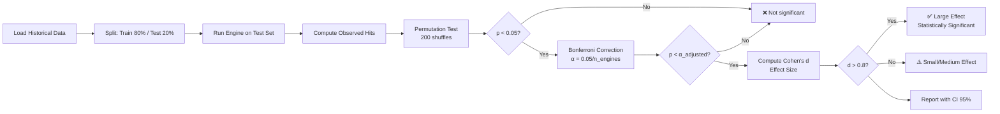
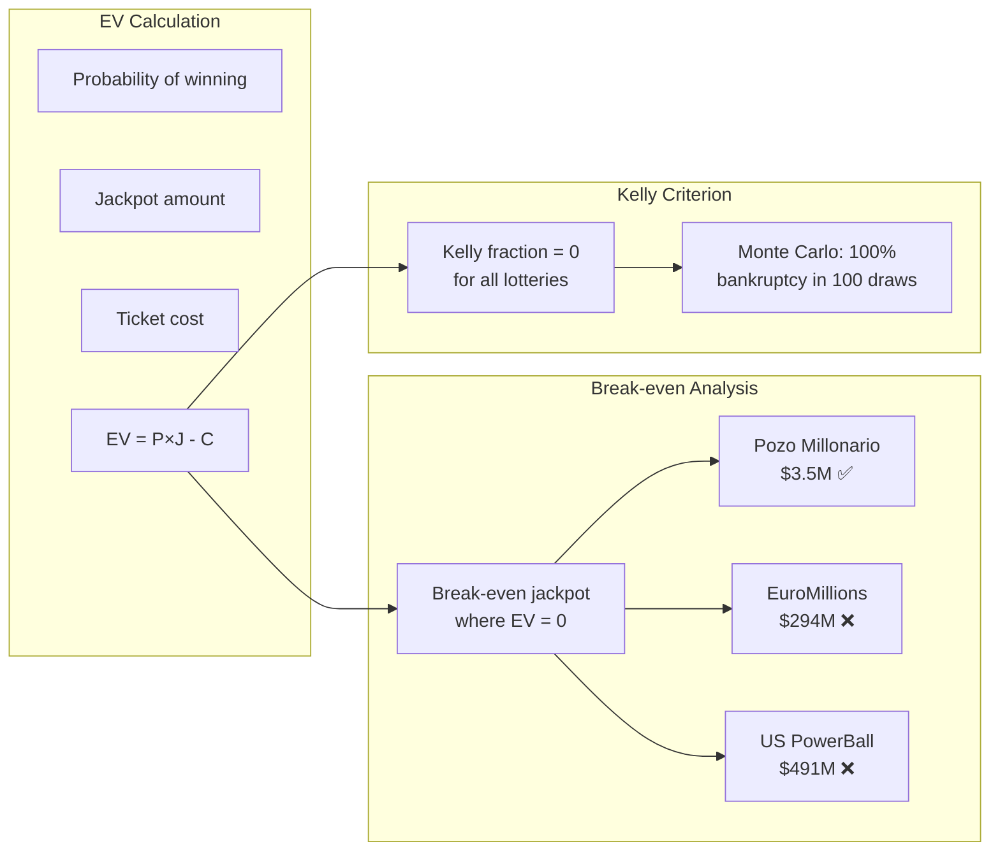

# 🎰 LotteryPredictor v4.0

> Sistema completo de análisis y predicción de loterías globales con IA. 49 loterías, 10 motores, Kelly Criterion, EV Calculator, MCP Server.


## 📊 Estadísticas del proyecto

| Métrica | Valor |
|---------|-------|
| Loterías soportadas | 49 (47 con datos) |
| Motores de predicción | 10 (9 estadísticos + LSTM) |
| Sorteos analizados | 22,000+ |
| Fuentes de datos | 4 (quicklotto.io, bettip.co.za, GitHub, scraping) |
| Lenguajes | Python 3.12 + TypeScript 5 |
| Framework ML | TensorFlow 2.21 |
| Framework Web | Next.js 16 + shadcn/ui |
| MCP Tools | 6 |
| Reportes Excel | 9 |
| Visualizaciones | 30 gráficos PNG |

---

## 🏗️ Arquitectura



---

## 🔄 Flujo de predicción



---

## 🧠 Pipeline de backtesting riguroso



---

## 💰 Expected Value Analysis



---

## 📡 Fuentes de datos

```mermaid
graph TB
    subgraph "QuickLotto.io MCP (39 lotteries)"
        QL1[list_lotteries]
        QL2[latest_results]
        QL3[lottery_results]
    end

    subgraph "bettip.co.za API (10 lotteries)"
        BT1[/uk49s/draws.json]
        BT2[/lotto/draws.json]
        BT3[/world/draws.json]
    end

    subgraph "GitHub Archives"
        GH1[daowa89/lottery-archive<br/>EuroMillions CSV]
        GH2[daowa89/lottery-archive<br/>German Lotto CSV]
        GH3[daowa89/lottery-archive<br/>Austrian Lotto CSV]
    end

    subgraph "Scraping"
        SC1[pozomillonario.info<br/>308 sorteos scraped]
    end

    QL1 & QL2 & QL3 --> CONV[JSON Converter]
    BT1 & BT2 & BT3 --> CONV
    GH1 & GH2 & GH3 --> CONV
    SC1 --> CONV

    CONV --> REG[Lottery Registry<br/>49 lotteries]
```

---

## ⚙️ Instalación

### Prerrequisitos

- Python 3.12+
- Node.js 18+ / Bun
- TensorFlow 2.21+ (para motor LSTM)
- ~50MB espacio disco (datos)

### Paso a paso

```bash
# 1. Clonar
git clone https://github.com/edgarfloresguerra2011-a11y/lottery-predictor.git
cd lottery-predictor

# 2. Instalar dependencias Python
pip install tensorflow aiohttp beautifulsoup4 openpyxl matplotlib

# 3. Descargar datos históricos
python3 scripts/lottery_predictor/data_fetcher/quicklotto_client.py
python3 scripts/download_more_lotteries.py

# 4. Ejecutar predicción
cd scripts/lottery_predictor
python3 main.py --lottery euromillions --engine markov_chain --predict

# 5. Iniciar Web UI
cd ../..
bun run dev  # → http://localhost:3000

# 6. Iniciar MCP Server
python3 scripts/lottery_predictor/mcp_server.py  # → http://localhost:8787/mcp
```

---

## 🎯 Uso

### CLI

```bash
# Listar todas las loterías
python3 main.py --list

# Describir una lotería
python3 main.py --lottery euromillions --describe

# Predecir con motor específico
python3 main.py --lottery euromillions --engine markov_chain --predict

# Backtestear todos los motores
python3 main.py --lottery euromillions --backtest all --max-test 100

# Backtest riguroso (con p-values)
python3 backtest/rigorous_backtester.py --lottery euromillions --permutations 500
```

### MCP Server

```bash
# Iniciar servidor
python3 mcp_server.py

# Usar desde cualquier cliente MCP (Claude Desktop, Cursor, etc.)
# Endpoint: http://localhost:8787/mcp
# Tools: list_lotteries, describe_lottery, list_engines, predict, backtest, get_latest_results
```

### Web UI

```bash
bun run dev  # → http://localhost:3000
```

Features de la UI:
- Selector de 49 loterías globales
- Selector de 10 motores
- Visualización de predicción con justificación por número
- Tabla de backtest comparativo con código de colores
- Información detallada de cada lotería

---

## 📈 Hallazgos clave

### ✅ Lo que SÍ funciona

| Hallazgo | Detalle |
|----------|---------|
| **Markov Chain en EuroMillions** | p=0.0000, Cohen's d=3.148 (large effect), +63.2% mejora |
| **Ensemble en UK49s** | +50% mejora (5,863 sorteos analizados) |
| **Pattern Detection en SA Lotto** | +28.6% mejora |

### ❌ Lo que NO funciona

| Hallazgo | Detalle |
|----------|---------|
| **Expected Value** | Todas las loterías tienen EV negativo (-68% a -84%) |
| **Kelly Criterion** | Fraction ≈ 0. No se recomienda apostar |
| **Monte Carlo bankroll** | 100% bancarrota en 100 sorteos simulados |
| **LSTM** | No supera a estadística simple. Confirma aleatoriedad |

### 🚨 Detección de trampa

| Lotería | Hallazgo |
|---------|----------|
| **Pozo Millonario** | 35% de sorteos con patrones sospechosos + error duplicado en sorteo #952 |
| **EuroMillions** | 4 números no aleatorios (6, 30, 33, 41) — posible sesgo mecánico |
| **La Primitiva** | 3 números no aleatorios — la más limpia de las analizadas |

---

## 📂 Estructura del proyecto

```
lottery-predictor/
├── index.html                    # Landing page (GitHub Pages)
├── README.md                     # Este archivo
├── scripts/
│   ├── lottery_predictor/        # Backend Python
│   │   ├── lotteries/            # 49 loterías configuradas
│   │   │   ├── base.py           # Clase abstracta
│   │   │   ├── pozo_millonario.py
│   │   │   ├── generic.py        # Loterías genéricas + configs
│   │   │   ├── quicklotto_registry.py  # 31 loterías de quicklotto
│   │   │   └── registry.py       # Factory pattern
│   │   ├── engines/              # 11 motores de análisis
│   │   │   ├── frequency.py      # Frecuencia + chi-cuadrado
│   │   │   ├── hot_cold.py       # Temperatura + mean reversion
│   │   │   ├── gap_analysis.py   # Overdue detection
│   │   │   ├── markov_chain.py   # Transiciones 1°/2° orden ⭐
│   │   │   ├── bayesian.py       # Beta posterior
│   │   │   ├── pattern_detection.py  # Runs test
│   │   │   ├── entropy.py        # Shannon + autocorrelación
│   │   │   ├── monte_carlo.py    # 10K simulaciones
│   │   │   ├── ensemble.py       # Combina 8 motores
│   │   │   ├── lstm_engine.py    # TensorFlow LSTM
│   │   │   └── kelly_criterion.py  # Bankroll management
│   │   ├── backtest/             # Validación
│   │   │   ├── backtester.py     # Backtest básico
│   │   │   └── rigorous_backtester.py  # Permutation tests + p-values
│   │   ├── data_fetcher/         # Scrapers
│   │   │   ├── quicklotto_client.py    # MCP client
│   │   │   └── convert_csv.py    # CSV → JSON
│   │   ├── main.py               # CLI
│   │   ├── cli_json.py           # API web (JSON output)
│   │   ├── mcp_server.py         # MCP Server productor
│   │   ├── daily_update.py       # Cron de actualización
│   │   ├── ev_calculator.py      # Expected Value Calculator
│   │   ├── visualizations.py     # Generador de gráficos
│   │   └── STUDY.md              # Estudio global
│   ├── build_*.py                # Generadores de Excel
│   └── download_more_lotteries.py
├── src/                          # Frontend Next.js
│   └── app/
│       ├── page.tsx              # UI principal
│       ├── layout.tsx
│       └── api/                  # 5 API routes
│           ├── lotteries/
│           ├── engines/
│           ├── predict/
│           ├── backtest/
│           └── describe/
├── download/                     # Reportes entregables
│   ├── *.xlsx                    # 9 reportes Excel
│   └── charts/                   # 30 gráficos PNG
├── data/                         # Datos (gitignored)
├── skills/                       # Skills del sistema
└── prisma/                       # DB schema
```

---

## 🔌 MCP Server

LotteryPredictor funciona como **productor MCP** — otros AI agents pueden consumirlo:

```json
{
  "mcpServers": {
    "lottery-predictor": {
      "command": "python3",
      "args": ["/path/to/mcp_server.py"],
      "env": {}
    }
  }
}
```

### Tools disponibles

| Tool | Descripción |
|------|-------------|
| `list_lotteries` | Lista las 49 loterías soportadas |
| `describe_lottery` | Detalles de una lotería específica |
| `list_engines` | Lista los 10 motores disponibles |
| `predict` | Genera predicción para una lotería |
| `backtest` | Resultados de backtesting (cached) |
| `get_latest_results` | Últimos resultados en vivo (quicklotto.io) |

---

## 📄 Licencia

MIT License — libre para uso comercial y personal.

## ⚠️ Disclaimer

La lotería es matemáticamente desfavorable (EV negativo). Este sistema es para fines **educativos y de análisis estadístico**. No garantiza ganancias. Juega con responsabilidad.

**Si sientes que el juego te está afectando, llama al 171 opción 6 (Salud Mental) en Ecuador.**

---

## 🤝 Contribuir

1. Fork el repo
2. Crea tu feature branch (`git checkout -b feature/nueva-loteria`)
3. Commit (`git commit -m 'Add nueva lotería'`)
4. Push (`git push origin feature/nueva-loteria`)
5. Abre un Pull Request

---

## 📬 Contacto

- **GitHub:** https://github.com/edgarfloresguerra2011-a11y/lottery-predictor
- **Issues:** https://github.com/edgarfloresguerra2011-a11y/lottery-predictor/issues

---

<p align="center">Built with ❤️ + Python + TensorFlow + Next.js + MCP</p>
